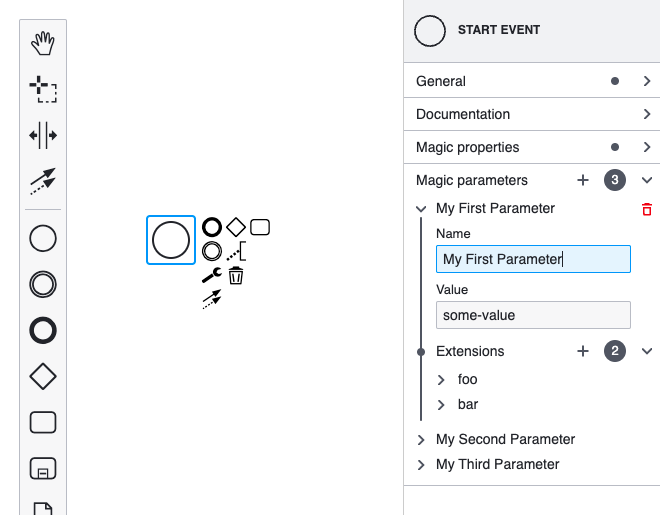

> Extending the properties panel changed significantly with `bpmn-js-properties-panel>=1`. For the `0.x` version of the library, check out [the old version of this example](https://github.com/bpmn-io/bpmn-js-examples/tree/b20919ac2231abf3df45b9dc9a2561010009b4a2/properties-panel-extension).

# Properties Panel List Extension Example

This example is based on [the properties panel extension example](../properties-panel-extension).
Its goal is to present how the 1.x series of [bpmn-js-properties-panel](https://github.com/bpmn-io/bpmn-js-properties-panel) support (nested) list properties.



## Prerequisites

* You know how to extend the properties panel. Check out [the properties panel extension example](../properties-panel-extension) for guidance.


## About

Most of the code of this example is a copy of [the properties panel extension example](../properties-panel-extension).
Here, we will only refer to what is added on top of that.

...add more...

## Running the Example

Install all required dependencies:

```
npm install
```

Build and run the project

```
npm start
```


## License

MIT
